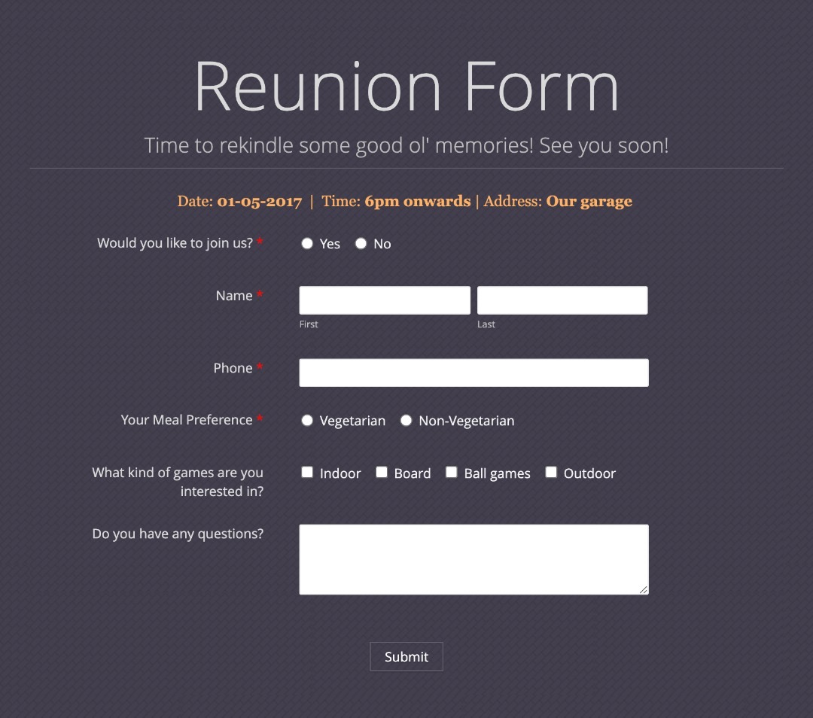

# 🎉 Reunion Form

A simple and responsive form built with HTML and CSS to gather RSVP details for a reunion event. This project showcases form handling, radio buttons, checkboxes, and modern UI design.

## 📝 Project Description

The **Reunion Form** allows users to confirm their attendance, provide contact details, choose meal preferences, select game interests, and ask questions—all in one smooth interface.

## 🔧 Features

- Clean and user-friendly layout
- Required fields with validations
- Radio buttons for meal preference and attendance
- Checkboxes for game preferences
- Mobile-responsive design (if applicable)

## 🚀 Live Demo

[Click here to view live](https://jamesmikecodes.github.io/Reunion-Form/)

## 📸 Screenshot



## 💻 Built With

- HTML5
- CSS3

## 📂 Folder Structure

```bash
📁 reunion-form/
├── index.html
├── styles.css
└── README.md
```
